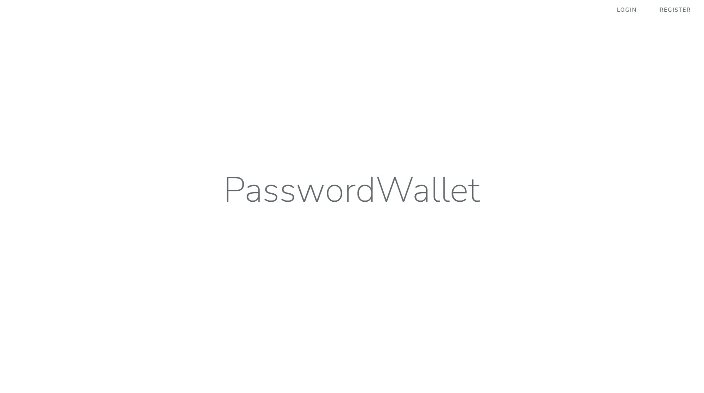
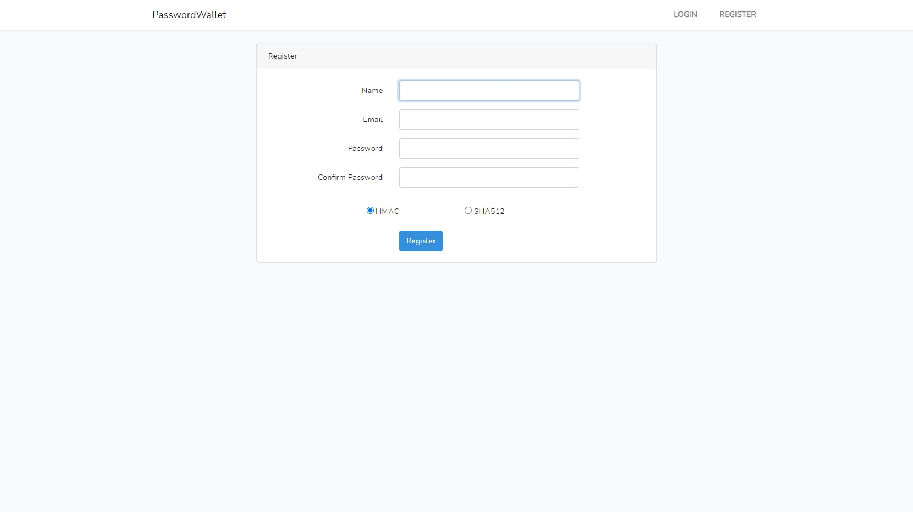
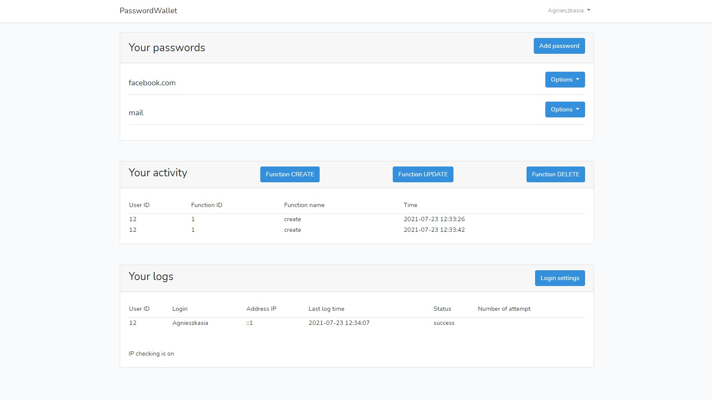
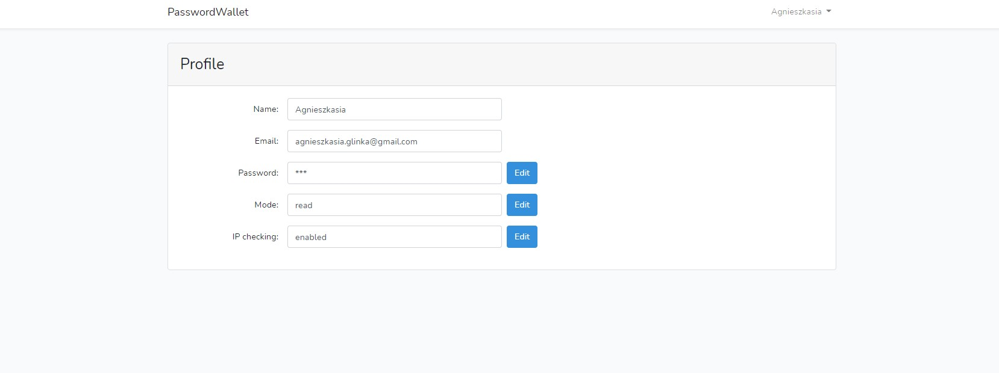
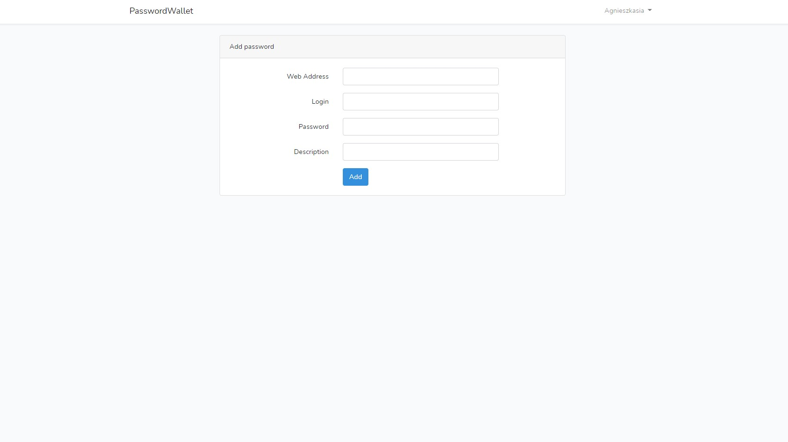
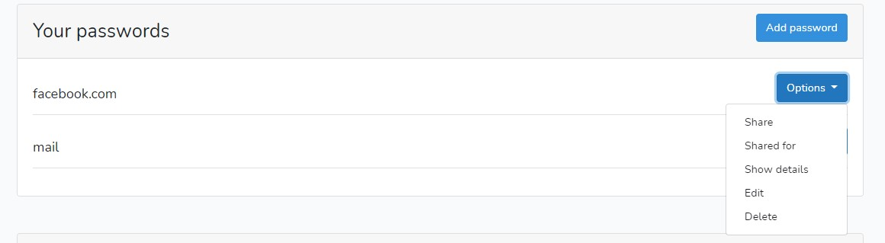
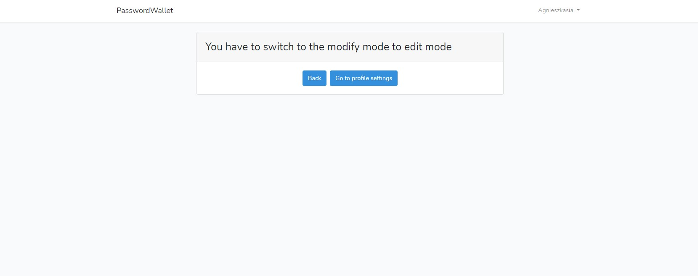
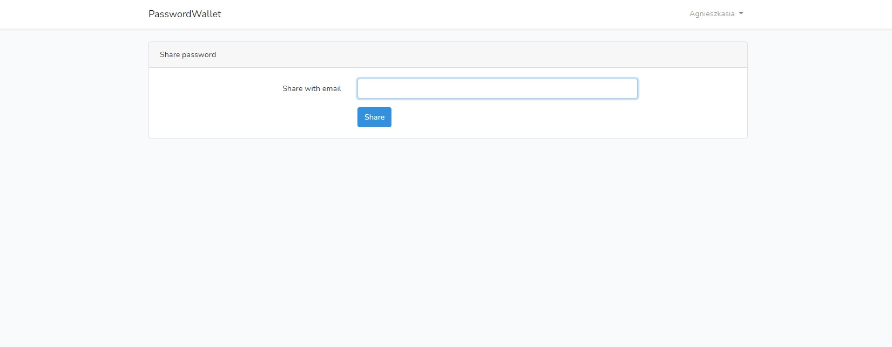
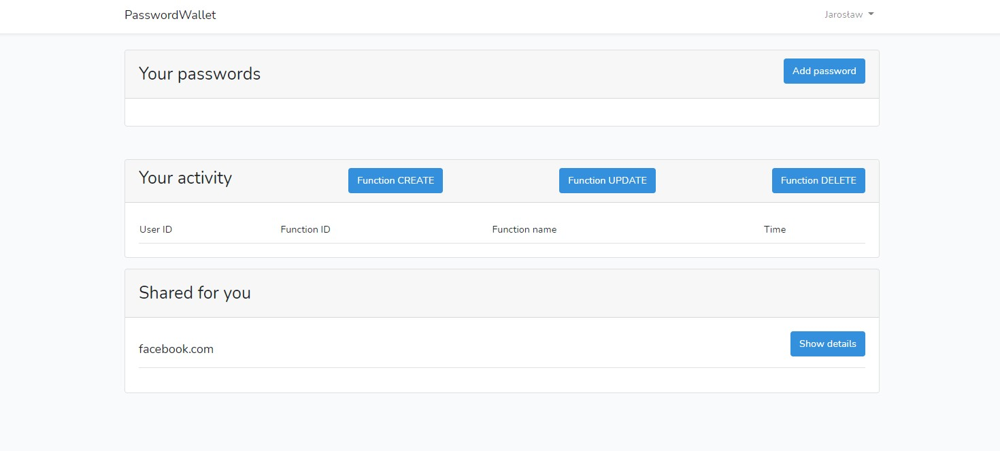

# PasswordWallet
Web application for storing passwords.

## Technologies
Project is created with:
* PHP 5.7
* Laravel 7
* Bootstrap 4
* XAMPP Apache server
* MySQL database

## Installation
To run this project:

* Download project
* Put project folder inside htdocs folder (path is something like this C:\xampp\htdocs)
* Start the Apache server in the XAMPP Control Panel
* Go to the browser and type in URL field: localhost/PasswordWallet/public/index.php

## Application functionality
* Register with two option of hashing login password (types of hashing - HMAC or SHA512)
* Add passwords to the wallet (stored in encrypted form) master password is necessary to decypt passwords stored in database
* Show passwodr only when user ask and give correct master password
* Unit tests
* register user logins (login time, login result, IP address of user)
* Block user account if user failed to log in at least four times
* Block the IP address if users failes to log in at least four times fro the address
* Display time and the number of subsequent incorrect logins
* Posibility of removing IP address blockade
* Share passwords for wallet with users
* Two modes of access to the wallet ("Read mode" and "modify mode")
* Display user Activity

